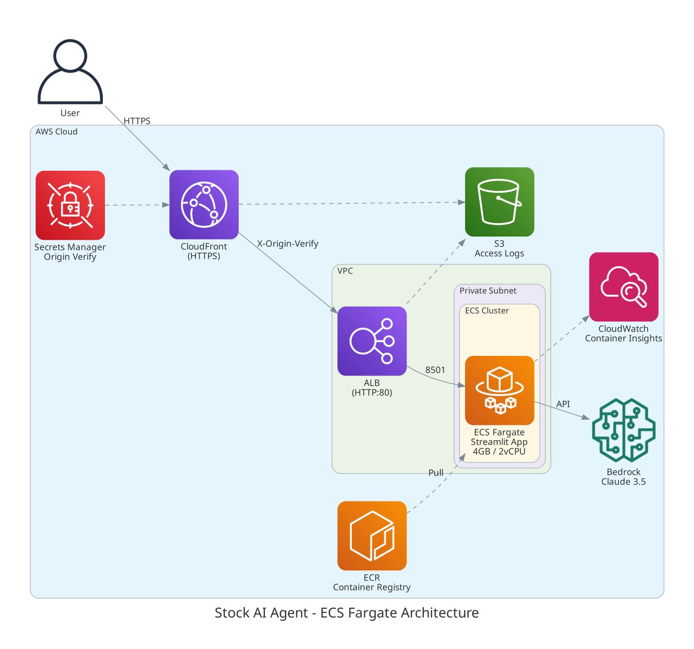
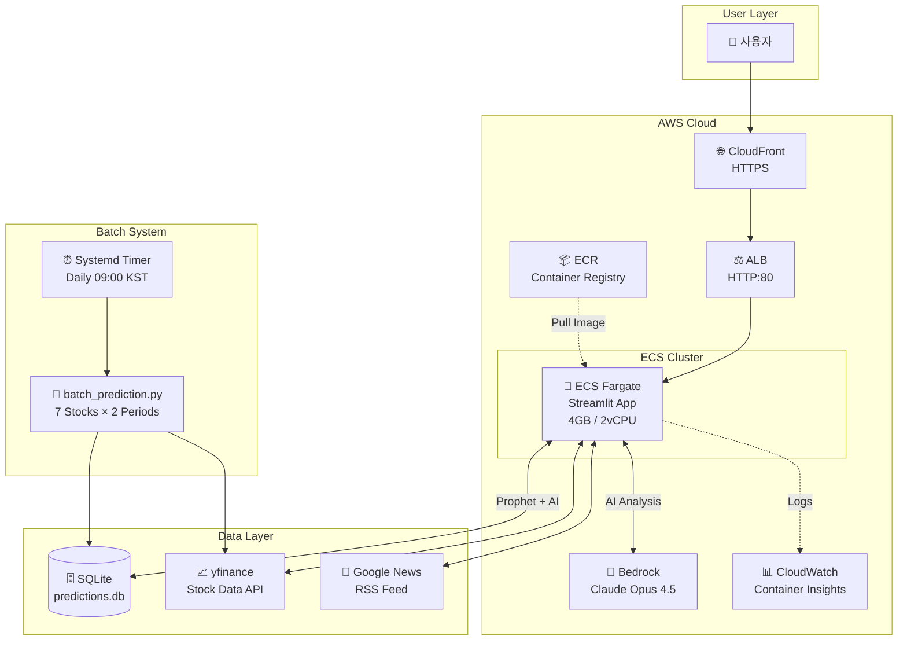
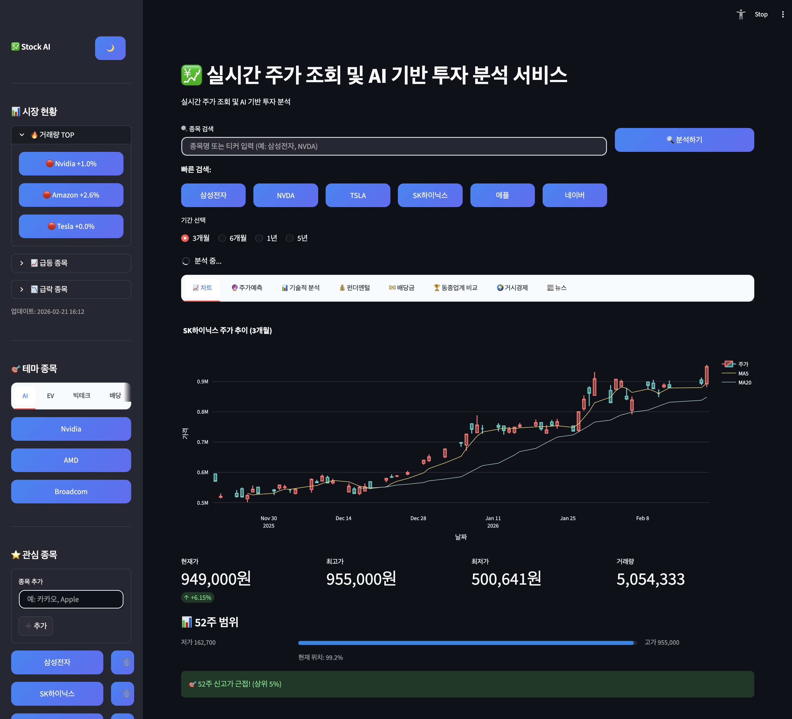
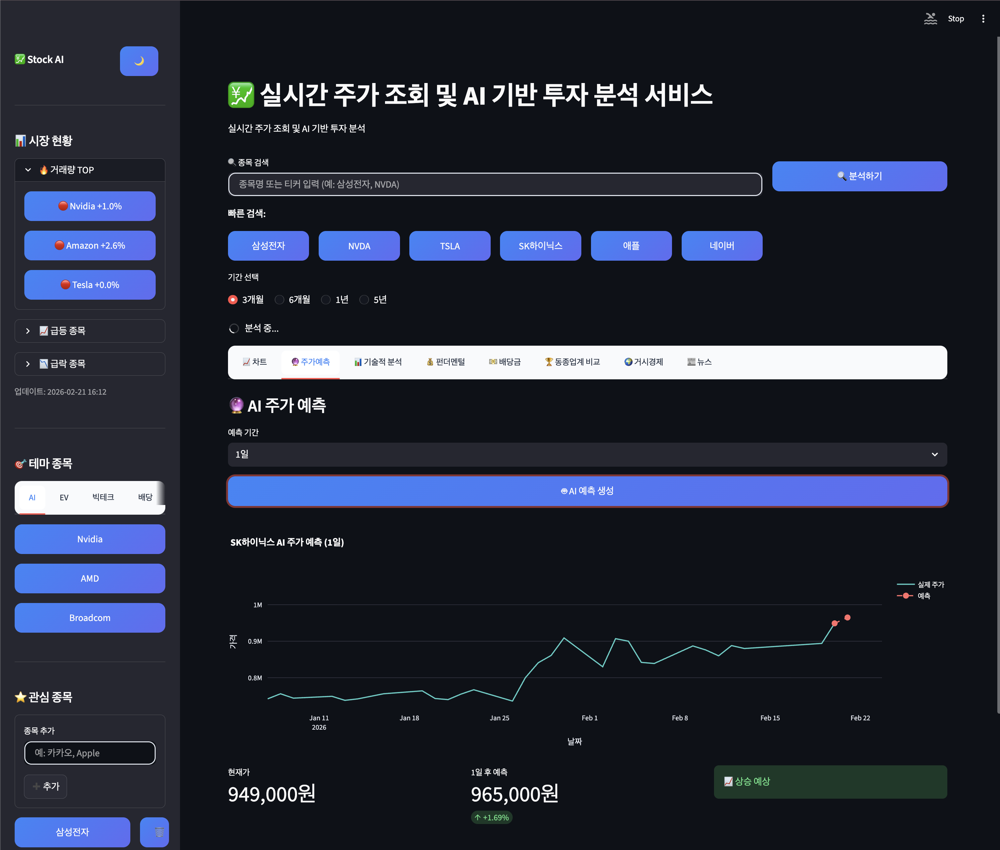

# 주식분석 및 예측 어플리케이션 Agent


Strands Agents SDK와 Amazon Bedrock Claude Opus 4.5 모델을 사용한 주식 정보 조회, 분석, 예측 Agent 입니다.

**14가지 AI 도구**로 기술적 분석, 펀더멘털 분석, 뉴스 감성 분석, 동종업계 비교, 거시경제 지표, 배당금 정보, **Prophet 시계열 예측**, **예측 정확도 추적**까지 종합적인 투자 판단을 제공합니다.

🌐 **Live Demo**: [https://d3ierd4g7thub6.cloudfront.net](https://d3ierd4g7thub6.cloudfront.net)

## 🎬 데모 영상

[](https://youtu.be/Fy1OkAH-PJ0?si=kBJSSUU2mSR5vsV5)

## 🏗️ 아키텍처



<details>
<summary>📊 아키텍처 다이어그램 (텍스트 버전)</summary>



</details>

**배포 구조**: User → CloudFront (HTTPS) → ALB (HTTP:80) → ECS Fargate (Streamlit Container) → Bedrock Claude Opus 4.5

**예측 시스템**: Systemd Timer (Daily) → Batch Prediction → SQLite (predictions.db) → Accuracy Dashboard

## 📸 스크린샷

### 메인 화면 - 주가 차트


### AI 기반 주가 예측


## 기능

### 📈 분석 도구 (14가지)
  1. 💰 현재가 조회 → 주가 데이터 수집
  2. 📊 기술적 분석 → RSI, MACD, 볼린저밴드 계산
  3. 💼 펀더멘털 분석 → P/E, ROE, 재무비율 분석
  4. 🏛️ 기관 보유 현황 → 주요 투자자 데이터 수집
  5. 🏆 동종업계 비교 → 경쟁사 지표 비교
  6. 🌍 거시경제 지표 → 금리, 환율, VIX 분석
  7. 📰 뉴스 감성 분석 → 최신 뉴스 NLP 분석
  8. 🔥 시장 현황 → 거래량 TOP, 급등/급락 종목
  9. 🎯 테마별 종목 → AI/반도체, 전기차, 빅테크, 배당주
  10. 💵 배당금 정보 → 배당수익률, 배당성향, 배당 내역
  11. 🔮 **Prophet 시계열 예측** → 통계 기반 주가 예측 (NEW)
  12. ⚡ **단기 기술적 지표** → VWAP, Stochastic RSI, ATR (NEW)
  13. 📉 **백테스팅 정확도** → 과거 예측 성능 측정 (NEW)
  14. 🤖 AI 종합 판단 → Claude Opus 4.5 앙상블 분석

### 🎯 주요 특징
- **실시간 진행 상황 표시**: AI 분석 중 진행률 + 투자 팁 제공
- **매수/매도/관망 신호**: 종합 분석 결과를 한눈에 확인
- **NLP 뉴스 감성 분석**: Google News 기반 긍정/부정 점수화 (-100 ~ +100)
- **테마별 종목 탐색**: AI/반도체, 전기차/배터리, 빅테크, K-플랫폼, 배당주
- **시장 현황 대시보드**: 거래량 TOP, 급등/급락 종목 실시간 모니터링
- **배당 투자 가이드**: 배당수익률, 배당성향, 배당 내역 분석
- **한글 완벽 지원**: 모든 분석 결과를 한글로 친절하게 제공

### 🔮 예측 정확도 추적 시스템 (NEW)

| 기능 | 설명 |
|------|------|
| **앙상블 예측** | Prophet 시계열 + Claude AI + 단기 지표 결합 |
| **배치 예측** | 7개 종목 × 2개 기간 (1일/7일) 매일 자동 실행 |
| **정확도 대시보드** | 종목별/기간별 예측 적중률 시각화 |
| **자동 검증** | 예측 기간 경과 후 실제 가격과 자동 비교 |

**배치 예측 대상 종목:**
| 시장 | 종목 |
|------|------|
| 🇰🇷 한국 | 삼성전자, SK하이닉스, 현대자동차 |
| 🇺🇸 미국 | Amazon, Apple, Nvidia, Google |

## 기술 스택

| 카테고리 | 기술 |
|----------|------|
| AI Framework | Strands Agents SDK |
| AI Model | Amazon Bedrock Claude Opus 4.5 |
| Forecasting | Prophet (Meta), 앙상블 예측 |
| Frontend | Streamlit, Plotly |
| Data | yfinance, Google News RSS |
| Database | SQLite (예측 기록 저장) |
| Scheduling | Systemd Timer (배치 예측) |
| Infrastructure | AWS CDK (CloudFront, ALB, ECS Fargate, ECR, S3) |
| Security | CloudFront Prefix List, Secret Header 검증 |
| Logging | ALB/CloudFront Access Logs → S3 |

## 설치 방법

1. 가상환경 활성화:
```bash
source venv/bin/activate
```

2. 패키지 설치 (이미 완료됨):
```bash
pip install -r requirements.txt
```

## AWS 설정

Amazon Bedrock 사용을 위해 AWS 자격증명이 필요합니다:

```bash
# AWS CLI로 설정
aws configure

# 또는 환경변수 설정
export AWS_ACCESS_KEY_ID=your_access_key
export AWS_SECRET_ACCESS_KEY=your_secret_key
export AWS_DEFAULT_REGION=us-east-1  # 기본값: us-east-1
```

> **참고**: `AWS_DEFAULT_REGION` 환경변수를 설정하지 않으면 기본값으로 `us-east-1`이 사용됩니다.
> Bedrock Claude 모델이 지원되는 리전을 사용해야 합니다.

## 실행 방법

**Streamlit UI 버전 (추천):**
```bash
# 방법 1: 실행 스크립트 사용
./run_app.sh

# 방법 2: 직접 실행
source venv/bin/activate
streamlit run app.py
```

**CLI 버전:**
```bash
source venv/bin/activate
python stock_agent.py
```

브라우저가 자동으로 열리며 `http://localhost:8501`에서 접속 가능합니다.

## AWS 배포 (ECS Fargate)

### 1. Docker 이미지 빌드 & ECR 푸시

```bash
# 배포 스크립트 실행 (ECR 생성, 빌드, 푸시)
./deploy.sh

# 또는 수동 실행
AWS_ACCOUNT_ID=$(aws sts get-caller-identity --query Account --output text)
AWS_REGION=us-east-1

# ECR 로그인
aws ecr get-login-password --region $AWS_REGION | docker login --username AWS --password-stdin $AWS_ACCOUNT_ID.dkr.ecr.$AWS_REGION.amazonaws.com

# Docker 빌드 & 푸시
docker build -t stock-app .
docker tag stock-app:latest $AWS_ACCOUNT_ID.dkr.ecr.$AWS_REGION.amazonaws.com/stock-app:latest
docker push $AWS_ACCOUNT_ID.dkr.ecr.$AWS_REGION.amazonaws.com/stock-app:latest
```

### 2. CDK 인프라 배포

```bash
# CDK 디렉토리로 이동
cd cdk

# 의존성 설치
npm install

# AWS 계정 부트스트랩 (최초 1회)
npx cdk bootstrap

# 배포
npx cdk deploy
```

배포 완료 후 출력되는 **CloudFront URL**로 접속할 수 있습니다.

### 3. ECS 서비스 업데이트 (재배포)

```bash
# 새 이미지 배포 후 ECS 서비스 업데이트
aws ecs update-service --cluster StockAppCluster --service StockAppService --force-new-deployment
```

### 🔒 보안 구성
- ECS Fargate: Private Subnet에 배치 (직접 접근 불가)
- ALB: CloudFront Managed Prefix List로 CloudFront IP만 허용
- Origin 검증: X-Origin-Verify 비밀 헤더로 직접 ALB 접근 차단
- ECR: 이미지 스캔 활성화, 최대 10개 이미지 유지
- 로깅: ALB/CloudFront 액세스 로그 → S3 (90일 보관)

### 🐳 ECS Fargate 사양
| 항목 | 값 |
|------|-----|
| CPU | 2 vCPU |
| Memory | 4GB |
| Auto Scaling | 1-3 tasks (CPU 70% 기준) |
| Health Check | `/_stcore/health` |
| Container Insights | 활성화 |

## 사용 예시

```
📊 종합 판단: 관망 추천

현재가: 60,700원 (전일대비 -1.94%)
3개월 수익률: +31.67%

긍정 요인:
- 주가가 5일(60,420원), 20일(59,365원), 60일(52,830원) 이동평균선 위에 위치하여 전반적인 상승 추세
- RSI 56.67로 적정 구간에 위치 (과열/과매도 아님)
- 3개월간 31.67%의 강한 상승세 기록
- 볼린저밴드 중앙(57.61%) 부근에서 안정적 움직임

부정 요인:
- MACD(-231.81)가 시그널선 아래에 위치하여 단기 하락 모멘텀 존재
- 거래량 비율 47.6%로 다소 낮은 편
- 변동성이 52.08%로 높은 편이라 리스크 주의 필요

📰 뉴스 분석:
- "KEPCO stock jumps 9%" - 증권사의 목표가 상향 조정(70,000원)으로 주가 9% 상승했다는 긍정적 뉴스

⚠️ 투자 조언:
1. 전반적인 추세는 상승세이나 단기 하락 모멘텀이 감지됨
2. 높은 변동성을 감안하여 분할 매수 전략 고려
3. 60일 이동평균선(52,830원)을 지지선으로 활용 가능
4. 전기요금 정책, 원자재 가격 등 외부 변수에 민감하므로 관련 뉴스 모니터링 필요

⚠️ 투자 판단은 본인의 책임이며, 이 분석은 참고용입니다.
```

## 지원 기업

**미국 주식** (영문/한글 모두 지원):
- Amazon / 아마존 (AMZN)
- Apple / 애플 (AAPL)
- Tesla / 테슬라 (TSLA)
- Google / 구글 (GOOGL)
- Microsoft / 마이크로소프트 (MSFT)
- Meta / 메타 (META)
- Nvidia / 엔비디아 (NVDA)

**한국 주식**:
- 삼성전자 (005930.KS)
- SK하이닉스 / 하이닉스 (000660.KS)
- 네이버 (035420.KS)
- 카카오 (035720.KS)
- 현대차 / 현대자동차 (005380.KS)
- LG전자 (066570.KS)
- 포스코 (005490.KS)

**기타 한국 주식**: 6자리 종목코드를 직접 입력하면 조회 가능합니다.
- 예: "051910" (LG화학), "035720" (카카오)

다른 기업은 티커 심볼을 직접 입력하면 조회 가능합니다.

### 🎯 테마별 종목

| 테마 | 종목 |
|------|------|
| AI/반도체 | 엔비디아(NVDA), AMD, TSMC, 삼성전자, SK하이닉스 |
| 전기차/배터리 | 테슬라(TSLA), 리비안(RIVN), LG에너지솔루션, 삼성SDI |
| 빅테크 | 애플(AAPL), 마이크로소프트(MSFT), 구글(GOOGL), 아마존(AMZN) |
| K-플랫폼 | 네이버, 카카오, 쿠팡, 크래프톤 |
| 배당주 | 코카콜라(KO), 존슨앤존슨(JNJ), 맥도날드(MCD), AT&T |

## 프로젝트 구조

```
.
├── app.py                  # Streamlit UI (메인 애플리케이션)
├── stock_agent.py          # AI Agent 도구 정의 (14가지 도구)
├── prediction_tracker.py   # 예측 기록 SQLite 관리 모듈 (NEW)
├── batch_prediction.py     # 배치 예측 스크립트 (NEW)
├── predictions.db          # SQLite 데이터베이스 (자동 생성)
├── Dockerfile              # ECS Fargate 컨테이너 이미지 정의
├── deploy.sh               # ECR 빌드/푸시 및 ECS 배포 스크립트
├── run_app.sh              # 로컬 실행 스크립트
├── setup_cron.sh           # 크론잡 설정 스크립트 (NEW)
├── requirements.txt        # Python 패키지 의존성
├── batch-prediction.service  # Systemd 서비스 파일 (NEW)
├── batch-prediction.timer    # Systemd 타이머 파일 (NEW)
├── cdk/                    # AWS CDK 인프라 코드
│   ├── lib/
│   │   └── stock-app-stack.ts  # CloudFront, ALB, ECS Fargate, ECR 설정
│   └── bin/
│       └── stock-app.ts
├── logs/                   # 배치 예측 로그 디렉토리
├── images/                 # 스크린샷 및 아키텍처 이미지
└── README.md
```

## 배치 예측 설정

### Systemd Timer 활성화 (서버)
```bash
# 서비스/타이머 파일 복사
sudo cp batch-prediction.service /etc/systemd/system/
sudo cp batch-prediction.timer /etc/systemd/system/

# 타이머 활성화 및 시작
sudo systemctl daemon-reload
sudo systemctl enable batch-prediction.timer
sudo systemctl start batch-prediction.timer

# 상태 확인
sudo systemctl status batch-prediction.timer
```

### 수동 실행
```bash
# 배치 예측 수동 실행
source venv/bin/activate
python batch_prediction.py
```

### 예측 정확도 대시보드
앱 사이드바 최상단의 **"🎯 정확도 대시보드 보기"** 버튼을 클릭하여 확인할 수 있습니다.

## 코드 품질

- ✅ 중복 코드 제거 (공통 함수 추출)
- ✅ 에러 처리 강화 (try-except)
- ✅ 0으로 나누기 방지 (RSI, 변동성 계산)
- ✅ 데이터 검증 (NaN, 빈 데이터)
- ✅ 타입 안정성 (명확한 반환 타입)
- ✅ 병렬 데이터 로딩 (ThreadPoolExecutor)
- ✅ API 캐싱 (Streamlit cache, 5분 TTL)

## 주의사항

- yfinance는 Yahoo Finance API를 사용하므로 실시간 데이터가 약간 지연될 수 있습니다
- AWS Bedrock 사용 시 비용이 발생할 수 있습니다
- 투자 조언이 아닌 정보 제공 목적입니다

## 🤝 기여 방법

1. 이 저장소를 Fork 합니다
2. 새 브랜치를 생성합니다 (`git checkout -b feature/새기능`)
3. 변경사항을 커밋합니다 (`git commit -m 'Add 새기능'`)
4. 브랜치에 Push 합니다 (`git push origin feature/새기능`)
5. Pull Request를 생성합니다

## 📄 라이선스

이 프로젝트는 MIT 라이선스를 따릅니다. 자세한 내용은 [LICENSE](LICENSE) 파일을 참조하세요.
